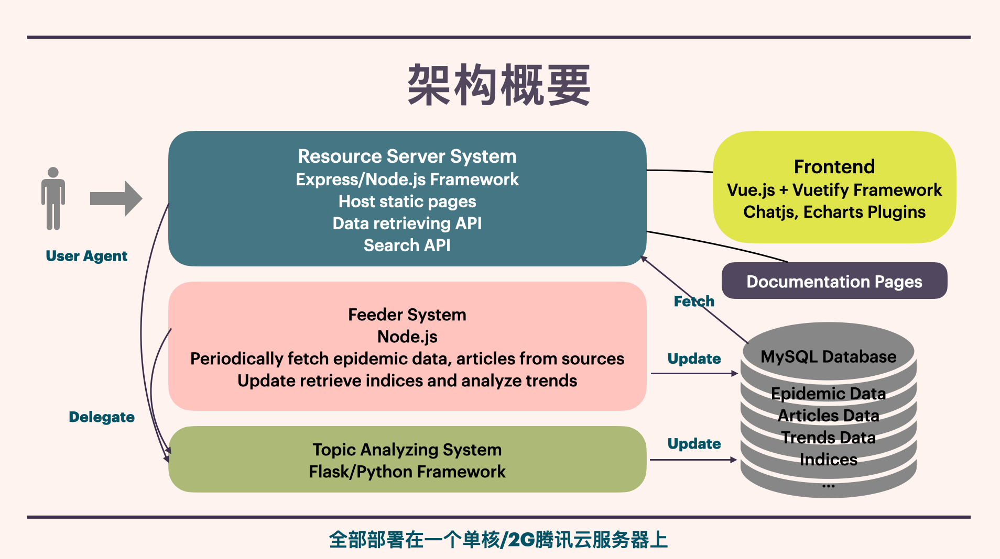

# AntiNCP Backend

版本 0.4.0

## 后端概要

后端分为三个子系统：WEB 服务系统、数据管理系统 和 主题分类系统。

**WEB 服务系统**：

- Express/Node.js

- 负责暴露80端口，响应用户的http请求；
- 提供检索服务API；
- 托管前端、文档页面。

**数据管理系统**：

- Node.js

- 负责管理MySQL数据库和Redis缓存系统；
- 定期从GitHub下载疫情数据并刷新数据库；
- 定期从外网获取疫情相关的报道、文章、推特等内容增量更新数据库，同时分析、提取文章热词信息，建立倒排索引；

**主题分类系统：**

- Flask/Python

- 响应数据管理系统的调用，对新增的文章进行主题分类；
- 响应 WEB 服务系统的委托，返回现有的主题名称；
- 重新 Fit 分类器的 API 等。

## 启动方法

一键在后台安装依赖+生成api+运行服务系统+运行数据系统：

`bash run.sh`

### 启动主题分类系统

主题分类系统的运行实例是另外两个系统的依赖项，所以必须先启动：

`npm run topic`

请确保 Flask 实例运行在 5000 端口，否则另外两个系统可能对接不上主题分类系统。

第一次运行会失败，这是因为仓库里没有存训练好的分类器模型，请参考 `topic/server.py` 源码中的 api ，先训练主题分类器。

### 启动WEB服务系统

快速启动：（当数据库中已有内容，不需要刷新时）

`npm start`

若要指定端口和输出调试信息：

`DEBUG=backend:* PORT=80 npm start`

### 启动数据管理系统

数据管理系统需要从外网获取信息，因此需要用到代理工具 `privoxy` 和 `ssr`

安装后，请确保：
- ssr socks5 处在 1080 端口运行。
- 环境中存在 `privoxy` ，并且 http proxy 必须在 8118 端口运行，代理规则是 `forward-socks5  /  127.0.0.1:1080 .`

快速启动：

`npm run feeder`

如果你的 ssr 拥有 http 代理，或者端口号与规定不一致，请在执行 `npm run feeder` 的同时指定环境变量 `HTTP_PROXY_PORT` 的值。

例如，在我的电脑上，ssr 的 http proxy server 端口是1087，那么我执行 `HTTP_PROXY_PORT=1087 npm run feeder`

若要输出调试信息：

`DEBUG=backend:* npm run feeder`

启动并重新加载疫情数据库：（适用于需要刷新数据库内容或发布时）

`npm run reload` 

启动、下载并加载最新疫情数据：（适用于需要更新数据源时，注意下载会比较耗时）

`npm run download`

## 生成文档

在 backend/ 目录下执行 `npm run api` 即可

## 数据库

### 测试阶段数据库连接方法：

#### 本地版本

1. [下载 mysql server](https://dev.mysql.com/downloads/file/?id=492745) 并安装。
2. 按教程完成设置，建议密码用 `mdty2020` 这样与配置文件一致，为了兼容性请**用legacy模式密码**。在mac设置面板里启动 mysql server。
3. 修改后端的数据库配置为该服务器对应的配置`LOCAL_MYSQL_CFG`。

#### 远程测试版本

- 需要开启腾讯云服务器，并把服务器上 `/etc/mysql/mysql.conf.d/mysqld.cnf` 配置文件中的 `bind-access` 设置为 `0.0.0.0`；
- 在本地测试环境，`backend/database/db-manager` 头部的 `LOCAL_MYSQL_CFG` 需改为 `TENCENT_MYSQL_CFG`
- **测试完建议立即解除服务器上的端口绑定**，置 `bind-access` 为 `127.0.0.1`

## 缓存管理

运行整个后端前，请安装 Redis，并先在后台启动 redis-server

